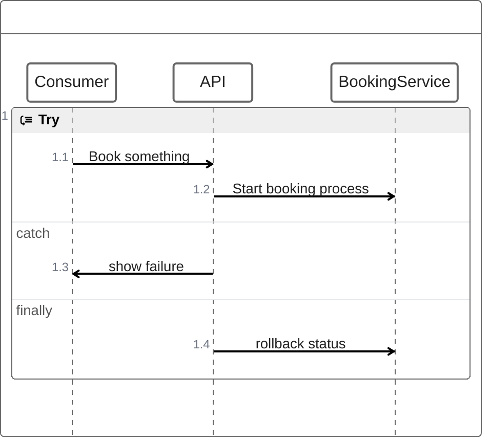

# Eco-ops

Improving Input by Making Models:
- python used to generate usage simulated data, enabling us to show and refine our concept
- ensuring the uploader uploads the correct thing

Privacy Concerns
- Disclosures

This project emphasizes transparency through the use of reports and paper trails. 

